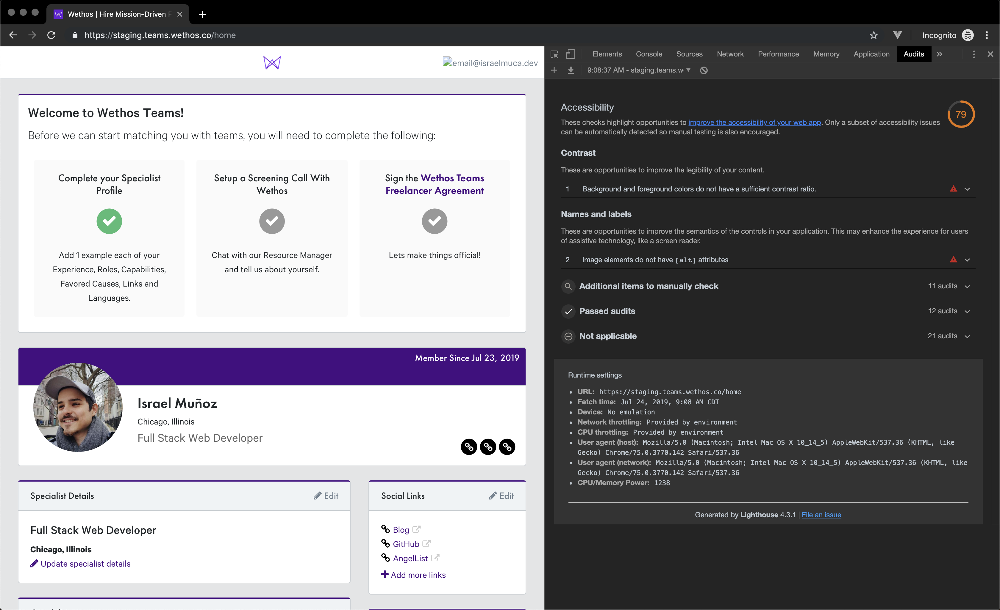

# Wethos Test
A hiring test from Wethos: Nuxt app to show a summary of the user's profile and projects

---

## Accessibility

Accessibility has been included in the current app, with proper outlines on the selected items, and an easy to use keyboard navigation.  
There are, however, a couple things from the report

The main take aways from this report are:

- Contrasts
  - Eg. The call to action boxes at the top, and the `Remove` from the `Capabilities` divs colors can be modified to improve contrast for people who have a situation with their eyesight.
- `[alt]` attributes
  - Some images are missing this attribute, which is essential for screen readers.