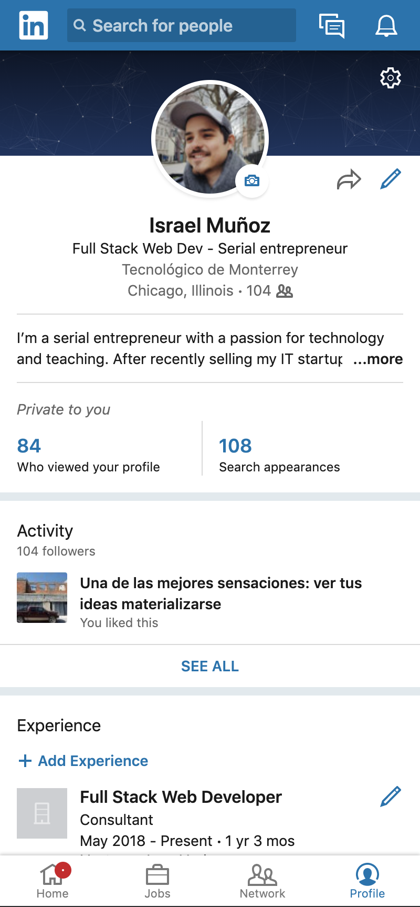
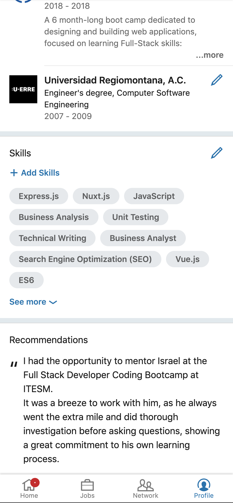
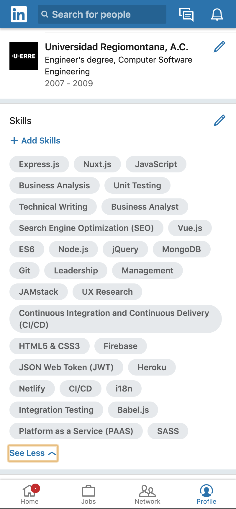
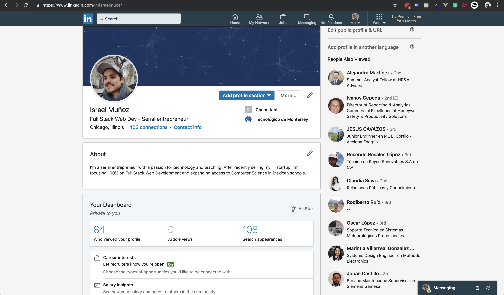
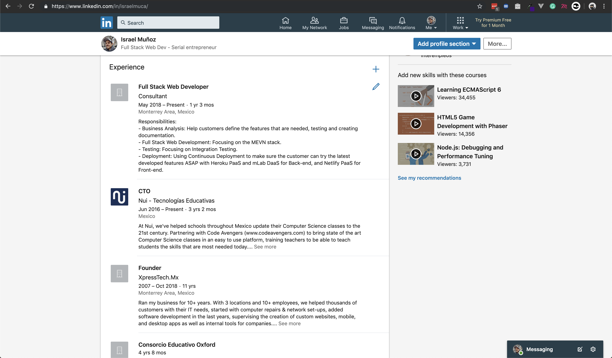
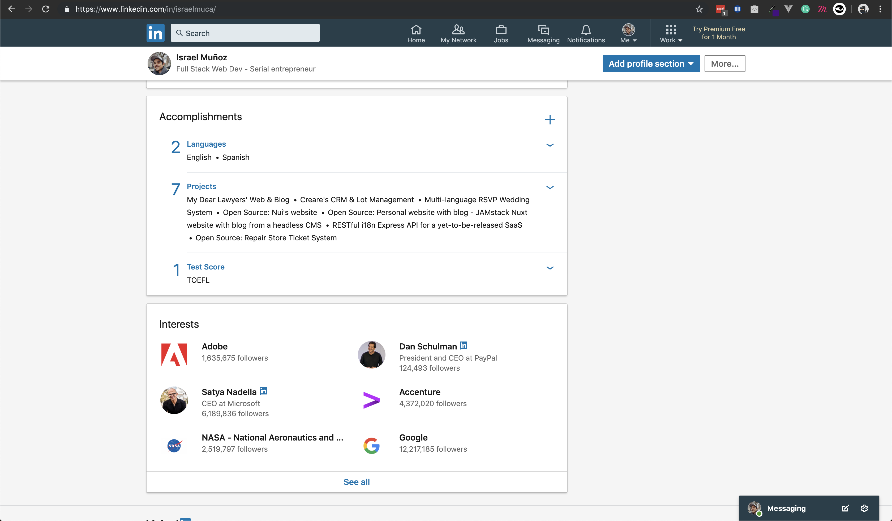
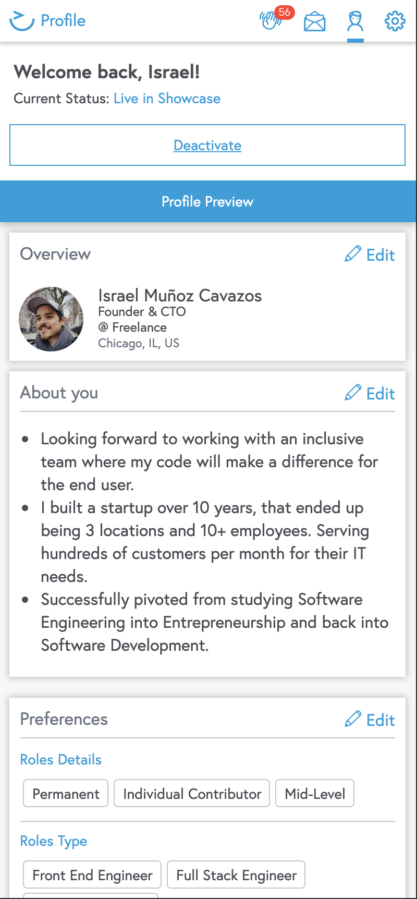
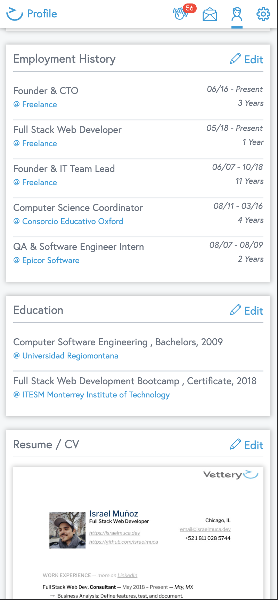
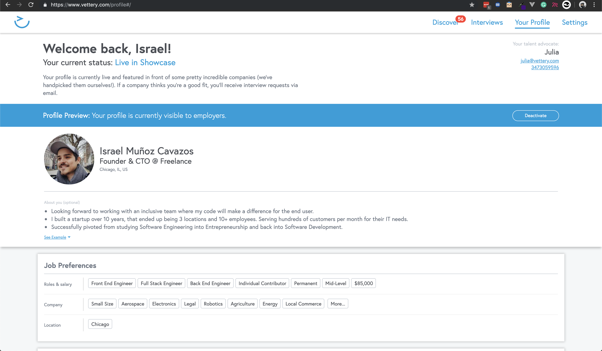
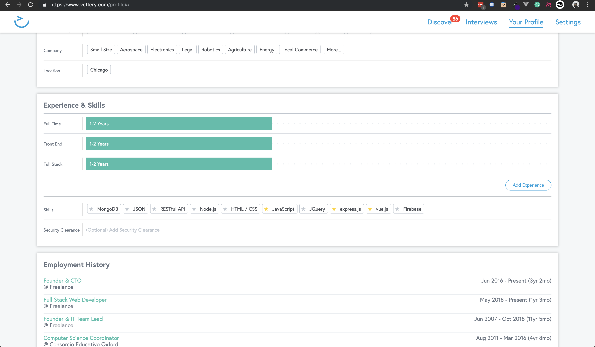

# Wethos Test
A hiring test from Wethos: Nuxt app to show a summary of the user's profile and projects

---

## Competitors

In this case, there are no 'competitors' per se, as it is an internal tool, but we can analyze competitors to get a better understanding of the possibilities in a profile page.  
I won't go into detail with this review, it will be mostly visual, to gather information to do wireframes.

### Linkedin

  

**Mobile Screens**

**Desktop Screens**

**Key Points**  
Linkedin chose to go with a single column implementation, that is centered on desktop, and goes full width on mobile.
This solution is easier to implement, as basically elements are just scaled down.  

They also make use of collapsible blocks, that show only a part of the information, to allow for an easier scrolling experience, since blocks by default, are small.

### Vettery

  

**Mobile Screens**

**Desktop Screens**

**Key Points**  
Just as Linkedin, Vettery chose to go with a single column implementation, that is centered on desktop, and goes full width on mobile.
One aspect.  

There are however, no collapsible blocks, as all information is presented in such a way that scrolling feels easy and natural.  
It is important to note that they, contrary to Linkedin, show less details in general.