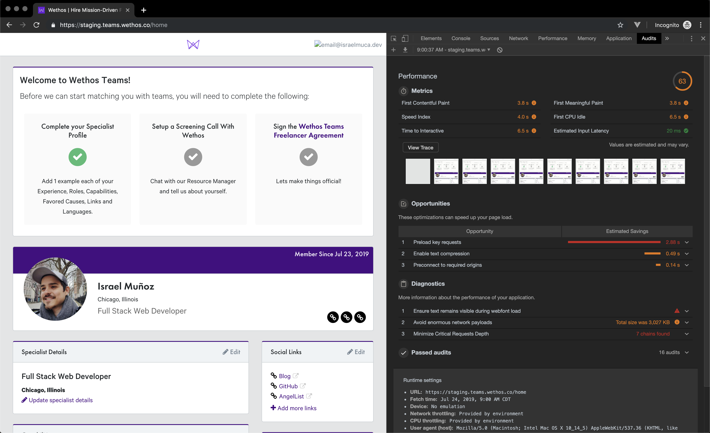

# Wethos Test
A hiring test from Wethos: Nuxt app to show a summary of the user's profile and projects

---

## Lighthouse

There are areas of opportunity in performance with the dashboard, because even with no throttling on, the site takes more than expected to load.  
One could argue that being a work application there's no need to focus so much on performance, but I believe with a few tweaks we can improve performance without much time investment.

The main take aways from this report are:

- Preload key requests
  - Eg. Main CSS
- Defer other requests
  - Eg. The whole list of capabilities can be run only if the user will modify them, no need to download them all from the beggining