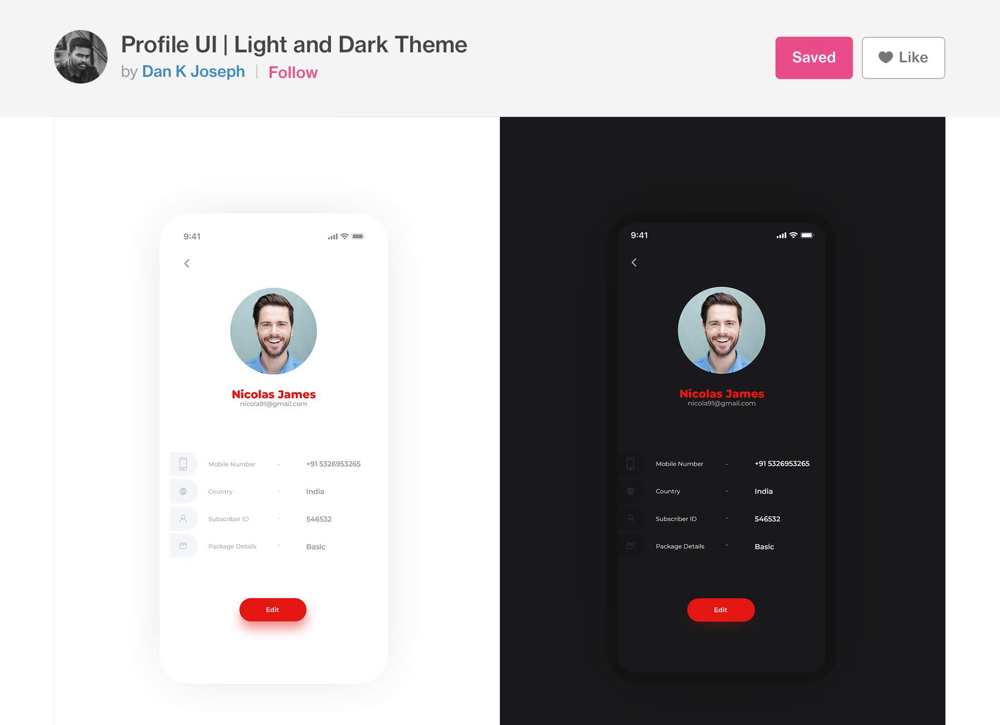
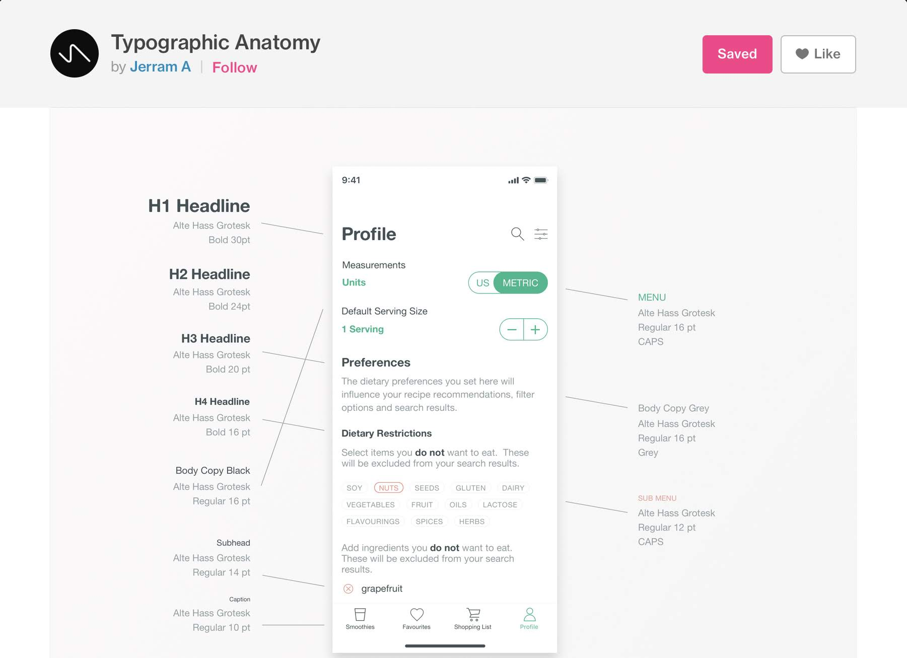
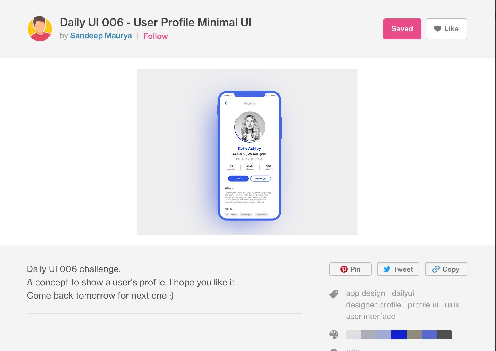
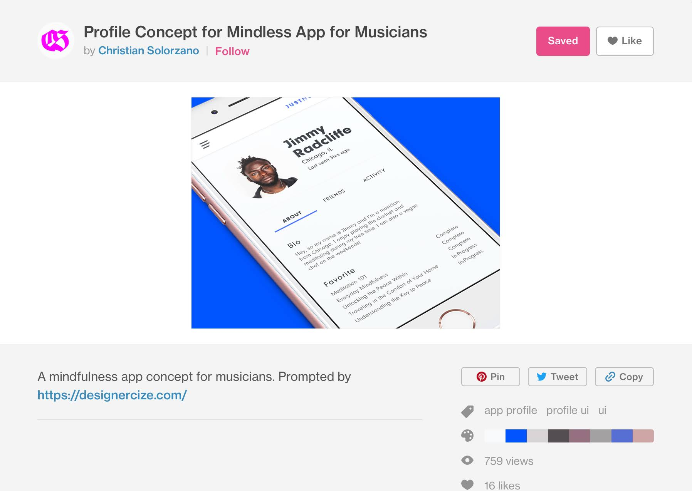
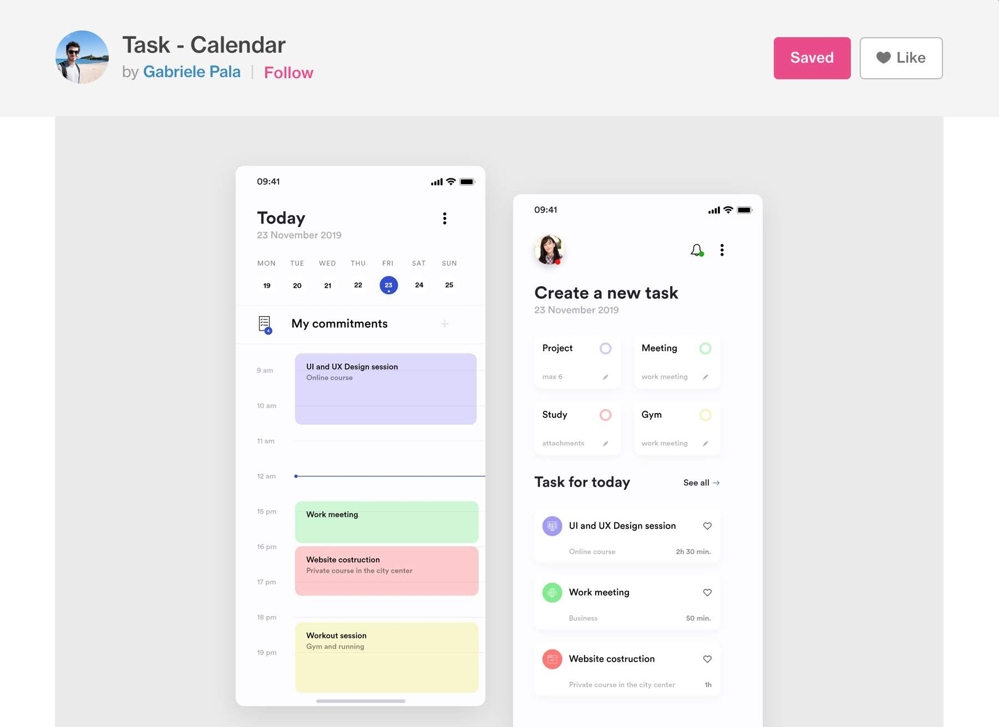

# Wethos Test
A hiring test from Wethos: Nuxt app to show a summary of the user's profile and projects

---

## Relevant information to show in app

Currently, there are several sets of information that are relevant to be shown:
- Specialist details
   - Image.
   - Name.
   - City, Country.
   - Title.
   - Description
   - Here since 
- Social links
   - Can be anything, from personal blogs to social media
- Languages
   - With skill level (1-5)
- Capabilities
   - Title
   - Subtitle *this is common in my case, for all capabilities, as I'm only selecting Development ones. For mobile this could be an anchor where we could expand from there to see the details of all the titles in that 'category'*
- Causes
   - Title
   - Text
- Experience
   - Title
   - Company
   - Text

Finally:
- Projects *which the customer required be a link of some sort, possibly to separate that from the main info*

---

## Main Features

- CTA @ top will be ignored for this test
- Links will be evaluated to see if they're a social network specifically, to show the proper svg
- Ideally we can show a little map? Or maybe current time (could help for general availability between teams)
- Sections should be easy to skim
- Clear clean look
- Rounded boxes with light shadow

---

## Inspiration from Dribbble

---

## Wireframes

